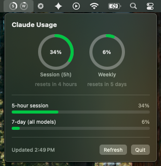
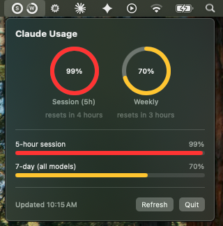

# claude-usage-bar

A tiny native macOS menu bar app that shows your Claude.ai usage as two donut rings — session (5-hour) and weekly — with a click-through panel for details.

[](https://github.com/microcross/claude-usage-bar/actions/workflows/build.yml)
[](LICENSE)
[](https://www.apple.com/macos/)
[](https://swift.org)

> **Unofficial.** This is a personal project, not affiliated with, endorsed by, or supported by Anthropic. It relies on an undocumented `claude.ai` endpoint that can change or break at any time. Use at your own risk. "Claude" is a trademark of Anthropic, used here only to describe what the tool does.

## Why

The Claude desktop app buries usage under Settings → Usage. This puts it one glance away, always visible in the menu bar.

## What it looks like

<p>
  
  <br><sub><em>Sped-up mockup for illustration — real usage fills over hours/days, not seconds.</em></sub>
</p>
<p>
  
  
</p>

Menu bar: two small rings, `S` (session) and `W` (weekly), filling clockwise as you use up your limit.

Click it for a panel with full donuts, reset times, and a bar-chart breakdown (session, 7-day all models, 7-day Opus). The rings and bars go green → yellow → red as you approach a limit.

## How it works

There's no public API for the Claude.ai subscription usage panel (this is different from the Anthropic Console's token-billing API, which only covers pay-as-you-go API keys). This app works the same way as it does in a browser tab:

1. It reads your `sessionKey` cookie value (the same cookie your browser uses to stay logged in to claude.ai).
2. It loads `claude.ai/api/organizations/.../usage` inside an embedded, invisible `WKWebView` — a real WebKit engine, which is what gets past Cloudflare's bot check (plain HTTP requests get blocked).
3. It parses the JSON response and renders it.

If the session key expires, the panel prompts you to paste a fresh one (see [Setup](#setup)).

## Requirements

- **macOS 13 (Ventura) or later** — the app uses `MenuBarExtra` and `SMAppService`, both macOS 13 APIs. (Built and tested on macOS 14–15.)
- The Swift toolchain, which ships with Xcode or the Xcode Command Line Tools (`xcode-select --install`).

## Install

```bash
git clone https://github.com/microcross/claude-usage-bar.git
cd claude-usage-bar
./build.sh
open UsageWidget.app
```

The app registers itself as a login item on first launch, so it starts automatically after that. For it to survive being moved, drag `UsageWidget.app` into `/Applications` before your first launch.

## Setup

Connect the app by pasting your Claude session key:

1. In your normal browser, sign in to [claude.ai](https://claude.ai).
2. Open DevTools → **Application** (Chrome) or **Storage** (Safari/Firefox) → **Cookies** → `https://claude.ai`.
3. Copy the **value** of the `sessionKey` cookie (starts with `sk-ant-sid…`). It's `HttpOnly`, so it only shows here — not via `document.cookie`.
4. Click the menu bar icon, paste it into the **session key** field, and hit **Save**.

The key is stored at `~/.claude-usage-widget/session_key`, with permissions locked to your user (`chmod 600`). This works no matter how you log in to Claude (email/password, Google, or other SSO).

## Privacy

Your session key never leaves your machine — it's used only to talk directly to `claude.ai` from your own Mac, and read by nothing else. There are no analytics, no telemetry, and no third-party servers involved.

Be aware the key is stored in **plaintext** at `~/.claude-usage-widget/session_key` (file permissions `0600`, so only your user account can read it), not in the macOS Keychain. It's a powerful credential — anyone who can read that file can act as you on claude.ai — so treat it like a password. Moving storage to the Keychain is a planned hardening improvement.

## Limitations

- Uses an **undocumented** `claude.ai` endpoint; Anthropic may change or remove it, which would break the app until it's updated.
- Only tested against **Pro/Max** subscription accounts. Free-tier accounts are untested and the usage response may differ.
- The `.app` is **ad-hoc signed**, so it's meant to be built from source (below). A downloaded prebuilt copy would be blocked by Gatekeeper.

## Development

The pure logic (usage-response parsing, org selection) lives in the `UsageWidgetCore` library and the AppKit/SwiftUI pieces in `UsageWidgetUI`, both covered by an XCTest suite:

```bash
swift test
```

## License

MIT — see [LICENSE](LICENSE).
